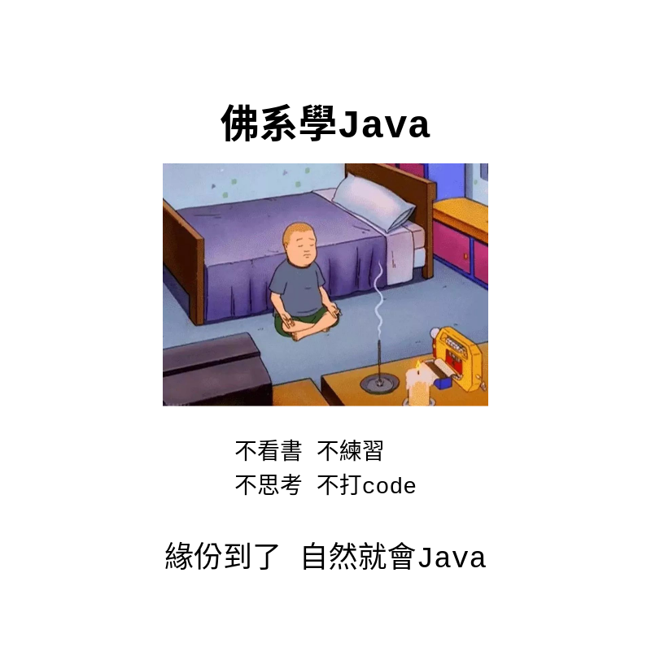

# 這是一個弱弱的 Java 教學

## 希望能幫助更多的朋友, 能開始會寫程式
> 也有計畫能辨交流讀書會

### 這裡會儘量用簡單的方式, 但是很佛系的方式, 讓大家了解
> 佛系, 懂?

#### 如果有任何不懂, 都可以互相交流

#### 本文小綱
* Section1: Java 是 ?
* Section2: Java 基礎
* Section3: Java修飾符與關鍵字
* SectionX: 未來進行式 ..., 未完待續

##### 謝謝打家, 打家 bye bye

###### 掰掰掰掰掰~~~~~