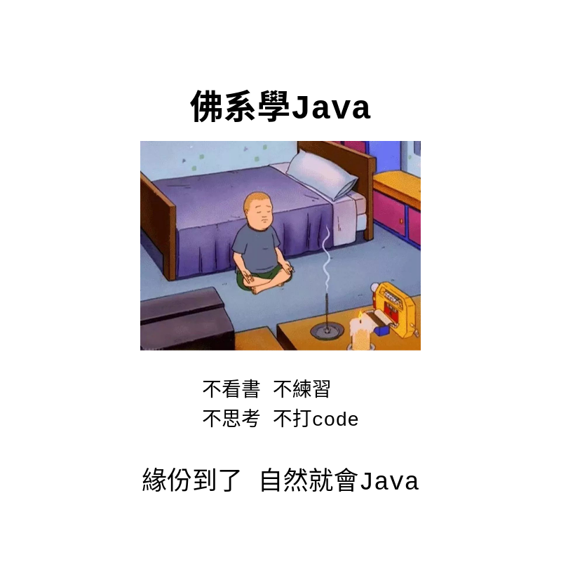

# 來學 Java 趴2

## Section2
### Java 基礎
	首先, Java是個物件導向(Object-Oriented)程式語言, 是種具有物件概念的程式設計典範，
	同時也是一種程式開發的抽象方針。

	物件則指的是類別（class）的實例。它將物件作為程式的基本單元，將程式和資料封裝其中，
	以提高軟體的重用性、靈活性和擴充性，物件裡的程式可以存取及經常修改物件相關連的資料。
	在物件導向程式程式設計裡，電腦程式會被設計成彼此相關的物件。


	一個 Java 程序可以認為是一系列對象的集合，而這些對象通過調用彼此的方法來協同工作。
    下面簡要介紹下類、對象、方法和實例變量的概念。

* 類：類是一個模板，它描述一類對象的行為和狀態。
* 對象：對像是類的一個實例，有狀態和行為。例如，一條狗是一個對象，
	它的狀態有：顏色、名字、品種；行為有：搖尾巴、叫、吃等。
* 方法：方法就是行為，一個類可以有很多方法。邏輯運算、數據修改以及所有動作都是在方法中完成的。
* 實例變量：每個對像都有獨特的實例變量，對象的狀態由這些實例變量的值決定。


### 編寫 Java 程序時，應注意以下幾點：

* 大小寫敏感：Java 是大小寫敏感的，這就意味著標識符 Hello 與 hello 是不同的。
* 類名：對於所有的類來說，類名的首字母應該大寫。如果類名由若干單詞組成，那麼每個單詞的首字母應該大寫，例如 MyFirstJavaClass 。
* 方法名：所有的方法名都應該以小寫字母開頭。如果方法名含有若干單詞，則後面的每個單詞首字母大寫。
* 源文件名：源文件名必須和類名相同。當保存文件的時候，你應該使用類名作為文件名保存（切記 Java 是大小寫敏感的），文件名的後綴為 .java。 （如果文件名和類名不相同則會導致編譯錯誤）。
* 主方法入口：所有的 Java 程序由 public static void main(String[] args) 方法開始執行。

### 第一個程式, 就來個 Hello World 歡迎世界
```java
public class HelloWorld {
   public static void main(String[] args) {
      /**
       * 和世界 Say hello, 原來這麼的簡單 
       */
       System.out.println("Hello, World");
   }
}

// 運行後, 會輸出: Hello, World
```

> 有些語法及關鍵字, 還不了解, 沒關係, 到後面就會有更深入的了解, 時間到了, 自然就會, 因為我們是佛系學習。


### 今天就到這裡囉
###### 寫寫打家, 打家 bye bye